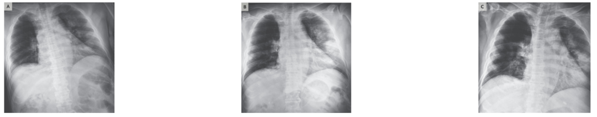
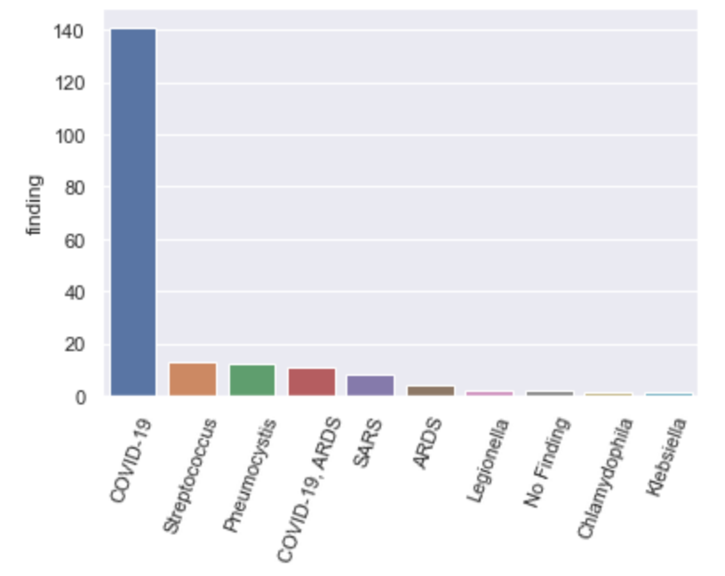
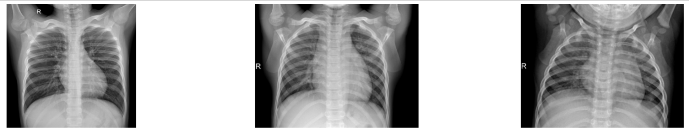

# covid-chestxray-detector
## Overview

Ce projet vise à détecter les patients atteint de COVID-19, à partir de radio pulmonaires.

## Données

Les données pour ce projet sont issues de [covid-chestxray-dataset](https://github.com/ieee8023/covid-chestxray-dataset) pour la partie COVID-19 et autres infections pulmonaires et du dataset de [chest-xray-pneumonia](https://www.kaggle.com/paultimothymooney/chest-xray-pneumonia) pour la partie radios "normales".

### Projet COVID-19-chestxray-data

Du projet COVID-19-chestxray-data nous avons extraits les radios qui sont prises en postéro-antérieures. Cela représente 195 observations




Les radios concernent différentes affections qui sont étiquetées comme suit :  

```
COVID-19          141
COVID-19, ARDS     11
Streptococcus      13
Pneumocystis       12
SARS                8
ARDS                4
Legionella          2
No Finding          2
Klebsiella          1
Chlamydophila       1
```



Nous avons regroupé les affections étiquetées COVID19 et COVID-19, ARDS en une seule étiquette covid-19 et les autres affections ont été classées en "Normal". Ce qui fait 152 observations où le COVID-19 est détecté et 43 qui sont considérées comme normales.

Pour que les données soient balancées, nous avons ajouté des données en provenance d'un autre dataset

### Projet chest-xray-pneumonia

Du projet chest-xray-pneumonia, nous avons extrait 109 radios de poitrine qui sont etiquetées comme "normal".



### Organisation des données

Ainsi nous avons 152 radios étiquetées COVID-19 et 152 étiquetées "Normale", sur les 152 normales il y 111 radio sans pathologie detectée  et 41 avec une pathologie pulmonaire.

Pour plus de facilité, nous avons copié les données de chaque dataset dans de nouveaux répertoires afin de faciliter l'entrainement du modèle.

* un répertoire **train** avec 2 sous-répertoire **0_normal** et **1_covid**
* un répertoire **test** avec 2 sous-répertoire **0_normal** et **1_covid** 
* un répertoire **predict** avec des radios pulmonires à prédire. Pour plus de facilité, nous avons prefixé le nom des fichiers de ce répertoire par la valeur à prédire (0 ou 1) 


## Modèle

## References

```
Joseph Paul Cohen and Paul Morrison and Lan Dao
COVID-19 image data collection, arXiv:2003.11597, 2020
https://github.com/ieee8023/covid-chestxray-dataset
```

