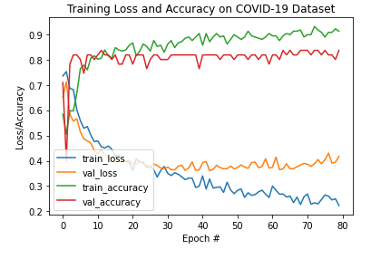
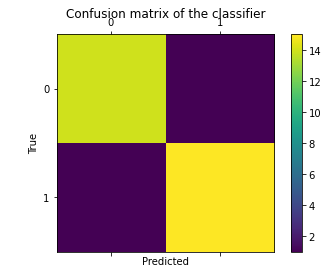

# Covid-19 Chest X-ray Detector

[Version française de ce document](./README-fr.md)

## Overview

**Disclaimer**: This is a study project don't use it in real life.

This is a Deep Learning model build awith a Convolutional Neural Network (CNN), to detect through chest X-ray COVID-19 pathology. The data (chest X-ray images) are from open-source images of patients with COVID-19, other lung infections and healthy patients.

The goal of this project is to automatically detect patients with COVID-19 in the dataset we have collected. 

We  have chosen to use a [Convolutional Neural Network (CNN)](https://en.wikipedia.org/wiki/Convolutional_neural_network), for image processing on which we used pre-formed weights with a [VGG19](https://gist.github.com/baraldilorenzo/8d096f48a1be4a2d660d) model. 

## Data

Data for this project come from [covid-chestxray-dataset](https://github.com/ieee8023/covid-chestxray-dataset) for the COVID-19 and other lung infections and from [chest-xray-pneumonia] dataset(https://www.kaggle.com/paultimothymooney/chest-xray-pneumonia) for the "normal" X-ray.

### Project COVID-19-chestxray-data

From the COVID-19-chestxray-data project we have extracted posteroanterior X-rays (i.e. 195 observations)


The X-rays relate to different pathologies which are labelled as follows: 

```
COVID-19          141
COVID-19, ARDS     11
Streptococcus      13
Pneumocystis       12
SARS                8
ARDS                4
Legionella          2
No Finding          2
Klebsiella          1
Chlamydophila       1
```


We have grouped pathologies labelled "COVID19" and "COVID-19, ARDS" into a single label "covid-19" and the other pathologies have been classified as "Normal". This makes 152 observations where COVID-19 is detected and 43 that are considered normal.

In order to have an equivalent number of data, we added data from another dataset

### Project chest-xray-pneumonia

From the chest-xray-pneumonia project, we have randomly extracted 109 chest X-rays that are labeled as "normal".


### Data organization

We have 152 X-rays labeled "COVID-19" and 152 labeled "Normal", from the 152 normal there are 111 X-rays with no pathology detected and 41 with lung pathology.

We have copied the data from each dataset into new directories to facilitate the training of the model.

* a   **train** directory with 2 sub-directories **0_normal** and **1_covid**
* a **test** directory with 2 sub-directories **0_normal** and **1_covid** 
* a  **predict** directory with chest x-rays to predict. We have prefixed the file names with the value to predict (0 or 1) 

## Image processing
Before training the model with the images, we normalized the images by transforming the RGB values from 0 to 255 by a scale change of 1/255 to obtain values between 0 and 1.
The images are resized to 320x382 pixels.

## Model

We chose to use a [Convolutional Neural Network (CNN)](https://en.wikipedia.org/wiki/Convolutional_neural_network), for image processing on which we used pre-formed weights with a [VGG19](https://gist.github.com/baraldilorenzo/8d096f48a1be4a2d660d) model. 

To this model we have added the following layers:
 - AveragePooling2D
 - Adding a new channel 
 - Activation layer 
 - Arbitrary deletion
 - Final activation layer


```
Model: "model_4"
_________________________________________________________________
Layer (type)                 Output Shape              Param #   
=================================================================
input_5 (InputLayer)         (None, 320, 382, 3)       0         
_________________________________________________________________
block1_conv1 (Conv2D)        (None, 320, 382, 64)      1792      
_________________________________________________________________
block1_conv2 (Conv2D)        (None, 320, 382, 64)      36928     
_________________________________________________________________
block1_pool (MaxPooling2D)   (None, 160, 191, 64)      0         
_________________________________________________________________
block2_conv1 (Conv2D)        (None, 160, 191, 128)     73856     
_________________________________________________________________
block2_conv2 (Conv2D)        (None, 160, 191, 128)     147584    
_________________________________________________________________
block2_pool (MaxPooling2D)   (None, 80, 95, 128)       0         
_________________________________________________________________
block3_conv1 (Conv2D)        (None, 80, 95, 256)       295168    
_________________________________________________________________
block3_conv2 (Conv2D)        (None, 80, 95, 256)       590080    
_________________________________________________________________
block3_conv3 (Conv2D)        (None, 80, 95, 256)       590080    
_________________________________________________________________
block3_conv4 (Conv2D)        (None, 80, 95, 256)       590080    
_________________________________________________________________
block3_pool (MaxPooling2D)   (None, 40, 47, 256)       0         
_________________________________________________________________
block4_conv1 (Conv2D)        (None, 40, 47, 512)       1180160   
_________________________________________________________________
block4_conv2 (Conv2D)        (None, 40, 47, 512)       2359808   
_________________________________________________________________
block4_conv3 (Conv2D)        (None, 40, 47, 512)       2359808   
_________________________________________________________________
block4_conv4 (Conv2D)        (None, 40, 47, 512)       2359808   
_________________________________________________________________
block4_pool (MaxPooling2D)   (None, 20, 23, 512)       0         
_________________________________________________________________
block5_conv1 (Conv2D)        (None, 20, 23, 512)       2359808   
_________________________________________________________________
block5_conv2 (Conv2D)        (None, 20, 23, 512)       2359808   
_________________________________________________________________
block5_conv3 (Conv2D)        (None, 20, 23, 512)       2359808   
_________________________________________________________________
block5_conv4 (Conv2D)        (None, 20, 23, 512)       2359808   
_________________________________________________________________
block5_pool (MaxPooling2D)   (None, 10, 11, 512)       0         
_________________________________________________________________
average_pooling2d_4 (Average (None, 2, 2, 512)         0         
_________________________________________________________________
flatten_6 (Flatten)          (None, 2048)              0         
_________________________________________________________________
dense_11 (Dense)             (None, 128)               262272    
_________________________________________________________________
dropout_4 (Dropout)          (None, 128)               0         
_________________________________________________________________
dense_12 (Dense)             (None, 1)                 129       
=================================================================
Total params: 20,286,785
Trainable params: 4,982,017
Non-trainable params: 15,304,768
_________________________________________________________________
```



## Prediction

With the images in the "predict" directory, we have testes our model.
This directory contains 31 images, including 16 images identified as having COVID-19. From the 15 images considered as normal 3 are from the 2nd data set.

The confusion matrix gives the following elements:



Out of 15 negative cases, 1 is not correctly identified and out of 16 positive cases, 1 is not correctly identified.


```
[[14  1]
 [ 1 15]]
              precision    recall  f1-score   support

           0       0.93      0.93      0.93        15
           1       0.94      0.94      0.94        16

    accuracy                           0.94        31
   macro avg       0.94      0.94      0.94        31
weighted avg       0.94      0.94      0.94        31
```

## Conclusion
This model has an honourable performance, but more data should be added to verify its real effectiveness. One possible improvement would be to add clinical data (Leucocyte level, temperature, etc.) to the image analysis (as in this [example] (https://cloud.google.com/blog/products/ai-machine-learning/how-20th-century-fox-uses-ml-to-predict-a-movie-audience)).

## References

```
Joseph Paul Cohen and Paul Morrison and Lan Dao
COVID-19 image data collection, arXiv:2003.11597, 2020
https://github.com/ieee8023/covid-chestxray-dataset
```

